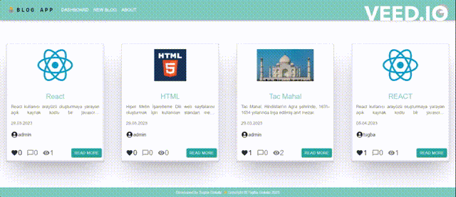

# BLOG APP

- This project is a website that pulls data from a real database and users can blog, edit, comment and like.

## `Installation`

```
npm install or yarn
```




## Project Skeleton

```
|----readme.md       (#Definition of the project)  
SOLUTION
├── src
|    ├── index.css
|    ├── index.js
|    ├── App.css
|    ├── App.js
|    ├── app
|    │   └── store.jsx
|    ├── assets
|    │   ├── about.png
|    ├── components
|    │   ├── auth
|    │   │   ├── LoginFom.jsx
|    │   │   └── RegisterForm.jsx
|    │   ├── blog
|    │   │   ├── Card.jsx
|    │   │   ├── CommentCard.jsx
|    │   │   ├── CommentForm.jsx
|    │   │   ├── DeleteModal.jsx
|    │   │   └── UpdateModal.jsx
|    │   ├── FooTer.jsx
|    │   ├── NavBar.jsx
|    ├── features
|    │   ├── authSlice.jsx
|    │   └── blogSlice.jsx
|    ├── helper
|    │   └── ToastNotify.jsx
|    ├── hooks
|    │   ├── useAuthCalls.jsx
|    │   ├── useAxios.jsx
|    │   └── useBlogCalls.jsx
|    ├── pages
|    │   ├── About.jsx
|    │   ├── Dashboard.jsx
|    │   ├── Detail.jsx
|    │   ├── Login.jsx
|    │   ├── NewBlog.jsx
|    │   ├── NotFound.jsx
|    │   ├── Profile.jsx
|    │   └── Register.jsx
|    └── router
|        ├── AppRouter.jsx
|        └── PrivateRouter.jsx
```

## Utilization

If an account does not exist, an account must be created first to create new blog.

Please pay attention to the following.

- You cannot comment on your own blog.
- Once you like a blog, you can't like it again.
- You cannot update or comment on blogs that do not belong to you.
- You must be registered to see the blog details.

## The project is developed using various libraries, and the libraries used and their purposes are listed below:

- `@reduxjs/toolkit`: Used for managing application state with Redux toolkit.
- `react-redux`: Used to integrate Redux into the React application.
- `axios`: Used for making HTTP requests.
- `react-router-dom`: Used for navigation and page routing within the application.
- `@mui/material-ui`: Material UI component library used for creating user interface elements.
- `yup`: Used for schema validation.
- `@mui/icons-material`: Used for using Material UI icons.
- `@mui/x-data-grid`: Used for creating data table components.
- `@tremor/react`: Used for creating charts.
- `formik`: Used for form handling and validation.
- `react-persist`: Used for storing application state in local storage.
- `react-toastify`: Used for displaying notification messages.


